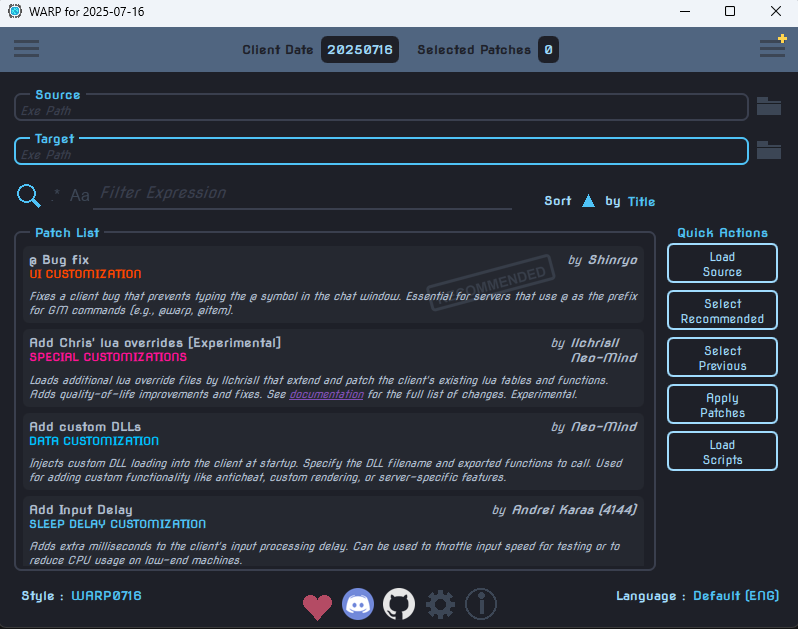
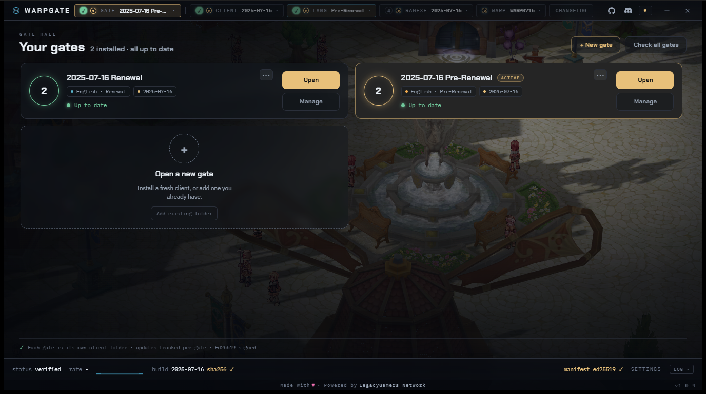

# WARP0716

## Development Status - Active Again

**WARP0716 development has resumed.** After a pause, the project is back open, and I'll keep working on patches as time allows.

**What's been built so far:**
- 41 recommended patches for the 2025-07-16 kRO Ragexe client
- Custom Jobs system (Reforged)
- EnableCustomFonts, fully rewritten to load .ttf fonts natively
- Multi-connection clientinfo support
- Cancel-to-exit on the service select screen
- …and plenty more improvements across the board

**Running a newer client?** [WARP2026](https://github.com/zVictorHG/WARP2026-Project) by zVictorHG targets the **2026-01-07 Ragexe** ([rAthena thread](https://rathena.org/board/topic/149414-2026-01-07-ragexe-clientinfo-warp/)). Some patches, like CustomJobs, will be ported over there as time allows.

Thanks to everyone who's tested, reported issues, and helped shape WARP0716. Your bug reports and feedback are what keep this project moving.

---

WARP patches for the 2025-07-16 kRO client build. 20+ patches fixed, dead/incompatible patches removed, and all patch descriptions rewritten for the 07-16 client. If you find something off, please [open an issue](https://github.com/CrazyBebop/WARP0716/issues).

## Getting the Client

The easiest way to play is **WARPGATE**, a one-click downloader and updater.

**[Download WARPGATE](https://mirror2.romirrors.com/downloads/Warpgate.zip)**

Unzip it and run it. WARPGATE downloads the full 2025-07-16 client for you, keeps the English translation up to date (powered by [llchrisll/ROenglishRE](https://github.com/llchrisll/ROenglishRE/)), and updates itself. No manual EXE patching, no hunting down GRFs, no ClientGenerator steps. Download, run, and play.

That's all most people need. The sections below are for server operators and tinkerers who want to build or customize their own client.

## What's New

See **[CHANGELOG.md](CHANGELOG.md)** for every patch and update, newest first.

The latest is the **July 29, 2026 Ragexe update**: the exit button on server select now works, switching to a different server mid-session is fixed, start-up is leaner with no 8 server limit, and a broken `clientinfo.xml` now tells you what is wrong. Those fixes are in the executable itself, so get the new one through **[WARPGATE](https://mirror2.romirrors.com/downloads/Warpgate.zip)** (the **RAGEXE** tab) rather than by re-WARPing an older exe.

**Custom Jobs Guide:** [HTML](docs/CustomJobs/CUSTOM_JOBS_GUIDE.html) | [Online](https://legacygamers.net/docs/public/customjobs-reforged/)

## Advanced: Patch Your Own EXE with WARP

WARP is the patcher that WARPGATE's client is built with. If you run your own server or want to hand-pick your patch set, you can WARP an exe yourself. This build of WARP is tuned for the **2025-07-16 kRO Ragexe** (build 175220998); point it at that unpacked exe.

You can get the WARP patcher two ways: from this repo (`win32/WARP.exe`), or by downloading it through [WARPGATE](https://mirror2.romirrors.com/downloads/Warpgate.zip).

### Setup
1. Launch `win32/WARP.exe` (or the copy from WARPGATE)
2. Load your unpacked exe
3. Select your patches and apply

### Recommended Patches
Click **"Recommended"** in the WARP GUI to select all recommended patches at once. A YAML profile is also included at `profiles/community_recommended.yml` for reference.

### Known Conflict
**NoPassEncr** requires **UseOldLogin**. Do not enable both **UseSSOLogin** and **NoPassEncr**. The WARP GUI handles this automatically, but YAML profiles need manual care.

## Issues & Suggestions

Found a bug or have a suggestion? Post it in the [Issues](https://github.com/CrazyBebop/WARP0716/issues) section or join the [Discord](https://discord.com/invite/7CpRVcmjeB).

## Donate

It is never required, but if you feel the need to contribute to the project financially, you can do so by clicking the button below.

**PayPal:** 

Special thanks to everyone who has donated. Your support keeps this project going.

## Credits

Built on [WARP](https://github.com/Neo-Mind/WARP) by Neo-Mind and [Warp2025](https://github.com/hiphop9/Warp2025) by hiphop9.
